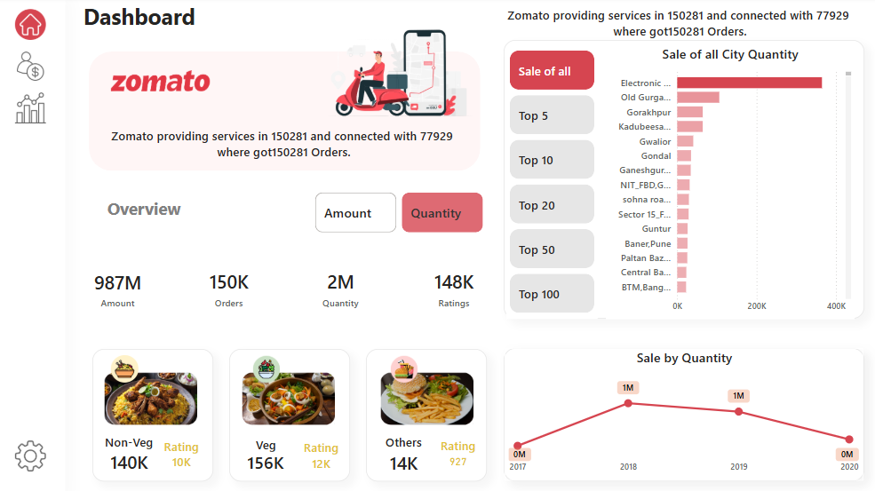

# Zomato Dashboard - Power BI Project

.png)

## Overview

This Power BI project visualizes **Zomato's online food delivery performance** across Indian cities. The dashboard is designed to help businesses, analysts, and decision-makers gain insights into orders, revenue, user behavior, and city-level performance trends.

### Key Insights Included:
- Total orders, users, and ratings
- Gender-wise user gains and losses
- Age-based user distribution
- Food category preferences (Veg, Non-Veg, Others)
- Sales analysis by city
- Ratings and user count by location
- Year-wise sales trend

---

## Dashboard Snapshots

### 1. User Performance Overview

---

### 2. Sales and Category Insights

---

### 3. City-wise Analysis

---

## Tools Used
- **Power BI** for data visualization
- **DAX** for data modeling
- **Excel** for data cleaning and preparation

---

## Repository Link
[Click here to view the repo](https://github.com/DataAnalystSachin/Zomato-dashboard)

---

## Author
**Sachin Jangir**  
*Data Analyst | Dashboard Designer | Power BI Enthusiast*  
📧 sachinjangir204@gmail.com
